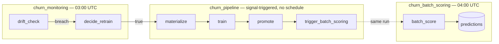

# Customer 360 Churn — Assessment Report

Raw pipe-delimited CSVs → a live churn score, deployed end to end to **Databricks Free
Edition** via an Asset Bundle (PySpark feature ETL, scikit-learn model — §2).

---

## 1. Data analysis → cutoff → churn definition

No churn flag in the data — label built from transaction behaviour. Full analysis
(baseline vs. the 2025-06 reactivation spike, churn-rate-by-cutoff sweep, selection
rule) in the [notebook](notebooks/cutoff_metrics_analysis.ipynb); result below.

| Aspect         | Value                                                                              |
| -------------- | ---------------------------------------------------------------------------------- |
| Cutoff         | **2025-03-01** (features use only events `< cutoff`)                       |
| Population     | ≥ 1 txn before cutoff —**56,114** customers                                |
| Window         | **90d** → `[2025-03-01, 2025-05-30)`, 2 days before the spike             |
| Label          | `churn = 1` iff 0 txns in window (absolute inactivity)                           |
| Base rate      | **0.198**                                                                    |
| Signal ceiling | **ROC-AUC ≈ 0.62** (near-memoryless transaction process) → gate design §5 |

Leakage guard: [`compute_features`](src/churn_dbx/features.py) filters every table
strictly `< cutoff` before aggregation — same call used by materialize, batch scoring,
and drift, so there's no skew. `2025-03-01` is the fixed fallback the adaptive
checkpoint (§4.1) rolls forward from once new data exists.

---

## 2. Platform selection

At this scale (~56k labelled rows, 100k scored), a local build spends most effort on
infra (MLflow server, scheduler, storage, serving container) — not the ML problem.
Databricks Free Edition provides that stack managed.

| Requirement                            | Local Python                | Databricks Free Edition       | Winner |
| -------------------------------------- | --------------------------- | ----------------------------- | ------ |
| Feature store / storage                | self-host Delta/parquet     | Unity Catalog + managed Delta | DBX    |
| Tracking + registry                    | run an MLflow server        | managed MLflow built-in       | DBX    |
| Orchestration                          | stand up Airflow            | native serverless Jobs        | DBX    |
| Compute                                | manual scaling              | serverless Spark, autoscaled  | DBX    |
| Serving endpoint                       | build + host + containerise | managed Databricks App        | DBX    |
| Single-command deploy                  | compose / k8s manifests     | one Asset Bundle + one script | DBX    |
| Governance                             | DIY                         | Unity Catalog grants          | DBX    |
| Setup cost                             | heavy scaffolding           | free tier, live in minutes    | DBX    |
| Flexibility (GPU, any lib, containers) | full control                | serverless-only               | Local  |

**Decision: Databricks.** Flexibility is the only column local wins, and every limit
that costs us there has a workaround with ML semantics intact.

**Limitations & workarounds**

| Limitation                   | Cause                                                  | Workaround                                                                               |
| ---------------------------- | ------------------------------------------------------ | ---------------------------------------------------------------------------------------- |
| No`pyspark.ml`             | Py4J security manager denies Spark ML JVM constructors | scikit-learn on the driver; Spark does all ETL                                           |
| No UC model-registry writes  | `s3:PutObject` denied to the serverless role         | model in a UC**Volume** + Delta `model_registry` table; MLflow for tracking only |
| No native Model Serving      | requires a UC-registered model (blocked above)         | **Databricks App** (FastAPI) reads the `predictions` table                       |
| No online tables / streaming | not supported on Free Edition                          | batch-only; scoped out (§6)                                                             |
| No GPU / custom containers   | Free Edition limit                                     | not load-bearing — ~0.62 AUC ceiling makes model family moot                            |

---

## 3. Pipeline dependency & schedule

Three serverless Jobs ([resources/jobs.yml](resources/jobs.yml)); tasks call the
wheel's console-scripts, not module paths.

| Job                     | Schedule                  | Tasks                                                                               |
| ----------------------- | ------------------------- | ----------------------------------------------------------------------------------- |
| `churn_monitoring`    | daily, 03:00 UTC          | `drift_check` → `decide_retrain` → (conditionally) trigger `churn_pipeline` |
| `churn_pipeline`      | signal-triggered, no cron | `materialize` → `train` → `promote` → trigger `churn_batch_scoring`      |
| `churn_batch_scoring` | daily, 04:00 UTC          | `batch_score` → write `predictions`                                            |



Monitoring runs **before** scoring so a signal-triggered retrain lands a fresh
champion first; `churn_pipeline`'s own `trigger_batch_scoring` scores immediately on
a passing gate; the 04:00 job guarantees a daily refresh even with no retrain.

- `queue.enabled` + `max_concurrent_runs: 1` — no overlapping writes to the same table.
- Retries on idempotent tasks (materialize/train/score/drift); **none on `promote`** —
  a rejection is a decision, not a flake.
- `materialize`/`train` resolve the cutoff to `--execution-date` via the checkpoint
  (§4.1) — a retrain trains on new data, not the last snapshot.

---

## 4. Retrain-signal detection

**Metric.** Population Stability Index between a baseline (`e`) and current (`a`)
distribution over `k` bins:

```
PSI = Σᵢ₌₁..k (aᵢ − eᵢ) · ln(aᵢ / eᵢ)
```

`< 0.10` stable, `0.10–0.25` moderate, `> 0.25` significant — one scalar for how far a
distribution has moved.

- **Binned on the predicted-score distribution** (bounded `[0,1]`), not counts/features —
  those grow with volume and false-fire. Feature PSI is logged only
  ([drift_check.py](src/churn_dbx/drift_check.py)).
- **Trigger:** `PSI(current, baseline) > 0.25` → `breach`.
- **Baseline** re-captured on each promotion — drift measured against the last release.
- `drift_check` emits the token as a **task value** and exits `0`; a condition task
  branches on the token to fire the retrain job.

Future work: a realized-performance tier (AUC on matured labels vs the gate floor) as a
slower, label-based concept-drift complement (§6).

### 4.1 Adaptive cutoff — retrain on new data

Naive rolling forward hits the June spike (churn → 0.009). `resolve_cutoff` (pure
function of `execution_date`, raw data, config → deterministic → idempotent,
[checkpoint.py](src/churn_dbx/checkpoint.py)):

1. `candidate = month_floor(min(execution_date, data_max) − window)`.
2. `candidate ≤ default` → **hold default**.
3. Probe `candidate`: `base_rate ∈ [0.05, 0.40] ∧ eligible ≥ min_eligible` →
   **roll** (relative label); else **walk back** month-by-month to the most recent
   healthy cutoff; none found → **hold default**.

Cutoff + `shifted` flag are logged to MLflow per run. On the static assessment file
this always resolves to `2025-03-01` (every later window fails the band check); on
moving data it advances run over run.

---

## 5. Model, quality gate & rollback

**Candidates:** `GradientBoostingClassifier`, `LogisticRegression` (scaled, balanced
class weight) — same deterministic split, `seed=42`, `test_size=0.2`. Each logged to
MLflow (params, metrics, model artifact); winner = `argmax(roc_auc)`, margin logged.

**Idempotency:** `input_hash = sha1(cutoff, window, definition, row_count, churn_mean, model_config)`. An existing version with the same hash is reused — no duplicate
registration on re-run.

**Gate** ([promote.py](src/churn_dbx/promote.py), baseline-grounded — an absolute
0.70 floor would reject every model given the 0.62 ceiling):

```
roc_auc            ≥ 0.58
ap_lift_over_base  ≥ 1.10
roc_auc            ≥ champion_roc_auc − 0.02
```

**Rollout = passing gate + alias move** (`champion` column of `model_registry`).
**Rollback = failure to promote** — non-zero exit, prior champion keeps serving, no
separate action. Verified live: a retrain took `champion` from the prior version in
the same `set_alias` write.

---

## 6. Further work

- **Scalability.** sklearn-on-driver fits ~56k rows comfortably; beyond driver memory,
  move to `pyspark.ml` GBT or `xgboost.spark.SparkXGBClassifier` on a paid cluster
  (Free Edition blocks Spark ML). Add distributed hyper-parameter search.
- **More serving layers.** On a paid workspace where UC-registry writes are allowed,
  stand up **native Model Serving** over a UC-registered model. Add a low-latency
  **online store** + `/predict/{customer_id}/live`, and a **streaming** pipeline for
  online feature updates (all unavailable on Free Edition today).
- **Monitoring depth.** Add the realized-performance (concept-drift) tier once labels
  mature, plus feature-attribution drift for explainability.
- **Governance.** A dedicated service principal for the App with scoped UC grants
  (`SELECT` on `predictions`), and finer dev/prod separation.

---

## 7. Results

Verified live on Free Edition serverless:

* **ROC-AUC: 0.621**
* **AP-lift:1.27**
* **100,000** customers scored
* App running

---

## Deliverable map

| # | Deliverable                                                            | Where                                                                                                                       |
| - | ---------------------------------------------------------------------- | --------------------------------------------------------------------------------------------------------------------------- |
| 1 | Feature store (one leakage-safe`compute_features`, shared)           | [features.py](src/churn_dbx/features.py), [labels.py](src/churn_dbx/labels.py), [materialize.py](src/churn_dbx/materialize.py) |
| 2 | Training (candidate comparison, sklearn on driver, MLflow-tracked)     | [train.py](src/churn_dbx/train.py)                                                                                           |
| 3 | Registry + quality gate (Volume + Delta,`champion` alias)            | [promote.py](src/churn_dbx/promote.py), [registry.py](src/churn_dbx/registry.py)                                              |
| 4 | Streaming (optional) — scoped out on Free Edition                     | §2, §6                                                                                                                    |
| 5 | Batch scoring (dated`predictions` partition)                         | [batch_score.py](src/churn_dbx/batch_score.py)                                                                               |
| 6 | Serving — Databricks App,`GET /predict/{customer_id}`               | [app/app.py](app/app.py), [resources/app.yml](resources/app.yml)                                                              |
| 7 | Deployment — Asset Bundle + one deploy script                         | [databricks.yml](databricks.yml), [scripts/deploy.py](scripts/deploy.py)                                                      |
| 8 | Monitoring — growth-aware score-PSI trigger + adaptive-cutoff retrain | [drift_check.py](src/churn_dbx/drift_check.py), [checkpoint.py](src/churn_dbx/checkpoint.py)                                  |
| 9 | Tests — feature/time-boundary, label, gate, checkpoint, end-to-end    | [tests/](tests/)                                                                                                             |
